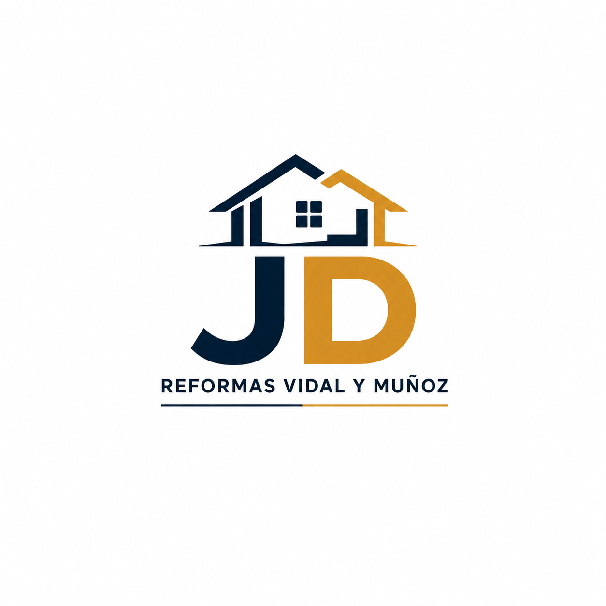
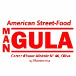
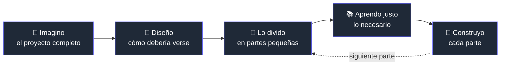

<!-- -->

# Hola, soy Toni

### 🚀 Estudiante de DAW · Desarrollador Web · Emprendedor

 

<h2 align="left">👋 Sobre mi</h2>

🎓 | Cursando **Desarrollo de Aplicaciones Web (DAW)**   
🏗️ | Construyendo **Nova Web Studio**, mi propio estudio de desarrollo web   
🌱 | Aprendiendo otros lenguajes, como React, Node.js   
💡 | Aprendo construyendo proyectos reales, no ejercicios aislados   
⚡ | El tiempo es mi recurso más limitado — compagino trabajo, estudios y proyectos personales   

<h3>🌟Sigueme en : </h3>
    

 

### 🛠️ Lenguajes y herramientas que he utilizado

 

### 🧱 Proyectos destacados

<table>
<tr>
<td width="50%" valign="top">

**🚀 Nova Web Studio**

Mi proyecto personal — la base de lo que quiero convertir en mi estudio de desarrollo web profesional.

</td>
<td width="50%" valign="top">

    
**🏗️ Web de Reformas**

Proyecto para una empresa real: panel administrador, gestión de clientes y obras, formularios, diseño responsive.

</td>
</tr>
<tr>
<td width="50%" valign="top">

**⛪ Web Hermandad**

Proyecto grande con historia, organización, banda, eventos, galería y noticias.

</td>
<td width="50%" valign="top">

**🧮 Calculadora de Horas Extras**

Proyecto personal para practicar JavaScript, PHP y bases de datos.

</td>
</tr>
<tr>
<td width="50%" valign="top">

**🍔 Restaurante Mangula**

Diseño web con estética americana inspirada en California.

</td>
<td width="50%" valign="top"></td>
</tr>
</table>

> 📝 *Las imágenes son marcadores de posición y algunos enlaces son provisionales — los sustituiré por capturas reales y URLs definitivas cuando estén disponibles.*

 

### 💭 Cómo trabajo

Prefiero diseños **minimalistas, limpios y modernos**, donde el contenido es el protagonista.

 

### 🔥 Otros intereses

`hardware` `NAS y servidores` `productividad` `fotografía` `branding` `marketing` `inteligencia artificial` `automatización`

 

### 📊 Estadísticas de GitHub

 

*"No quiero limitarme a aprender programación; quiero crear productos reales, resolver problemas y construir un negocio alrededor de ello."*

